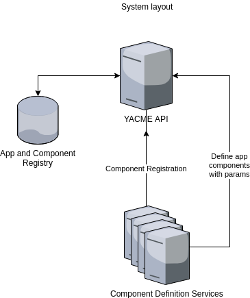
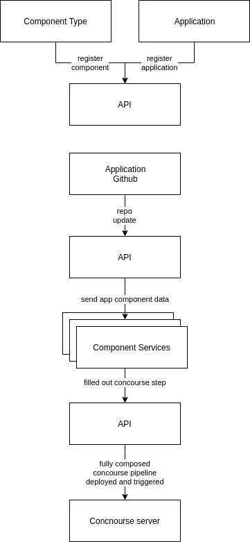

# YACME (Yet Another Config Management Engine)

YACME is an open-source application management platform, similar to Heroku. 

## Why

Configuration management is a painful process: there's pipeline configs, orchestrstion manifests, etc. And every one of those is tedious to maintain in a dynamic environemnt of an ever-scaling product. You have to keep track of the new pipe patterns, the new docker orgestration technology, and custom scaffolding built on top of all of that tech. Moving in and out of that headspace is mentally taxing and shouldn't necessarily be the responsibility of the developer. 

## What

This is a system that will allow for team[s] responsible for maintaining the pipelines and their pieces to do so without having to bother downstream service developers to force them to have to update configs. 

## How

Okay. That's great. Let's talk about the how. 

### Definitions

Because this introduces several oddly shaped concepts, let's define them:

* *App*: Code around which the pipeline revolves. Usually would be a web server application.
* *Component Type*: the template for pipeline interactions that will center around the `App`. This can be of 2 types:
  * `object` - object components are centered around a resource definition that needs to be managed (e.g. a database) and should include `create`, `check`, `update`, and `delete` actions.
  * `action` - an action component is just that: a CI action that gets executed (e.g. run tests) and has a single action, `execute`
* *Component*: App-specific component definition. This is the join of `App` and `Component Type` that holds app-specific parameters for that component (e.g. `MyApp`'s `posgres` instance).

### System Design

Let's start with the overall design. The system consists of 3 pieces: the main platform, the component services, and the CI server (not pictured).

#### Platform API

The platform api is the layer that keeps track of:

* *apps*: It holds references to the git repos and listens for updates
* *component types*: It registers component types and allows them to be added to individual apps
* *components*: It keeps track of what components were added to what app, whith their parameters and dependencies. 

Along with holding the data, the platform is responsible for generating the CI pipeline from the `component` definitions and the `component type` CI templates. Once it generates the pipeline it will push it to the CI platform

**API Definition**: [Swagger docs](https://editor.swagger.io/?url=https://raw.githubusercontent.com/gaorlov/YACME/master/contract/v1/api.yml)

#### Component Services

These are the services that are responsible for component action definitions. Because the platform assumes that the underlying CI platform is responsible for the full deploy/update/teardown of an application stack, the component services return the action definitions to manage their respective resources. 

This is weird to conceptualize in the abstract, so if we were to use `postgres` as an example, the `postgres-component` service would return 4 CI actions which would allow the CI to:
* `create` a new `postgres` instance for an `app` based on input params
* `check` on its status
* `update` it, should such a need arise
* and `delete` it on stack teardown. 

**API Definition**: [Swagger docs](https://editor.swagger.io/?url=https://raw.githubusercontent.com/gaorlov/YACME/master/contract/v1/component-interface.yml)

### Workflow

Now that we have the pieces described, let's talk about how a developer would use the platform to deploy an application.

#### User View

An end user (downstream developer) would register their app repo with the platform and add components. That's it. The system handles the rest based on the components added.

The only time the user would have to do anything else is if they need to add a new component type. Then they would have to spin up a new component service and register that with the system. Keep reading for that.

#### System View

The system view of the system consists of two main pieces: adding component types for use of downstream developers, and the actual runtime.

##### Adding Components

Adding a component type is pretty straightforward:

* The component service is spun up on a network visible to the platform
* The service follows the [contract](https://editor.swagger.io/?url=https://raw.githubusercontent.com/gaorlov/YACME/master/contract/component-interface.yml)
* The component is registered with the platform through its component type API

Ta-da! It is now available for everyone to use and add to their apps.

##### Runtime

Once the app repo is registered and the component pipeline is set up, the system listens for updates in the repo. Once an event happens, the platform:

* Reaches out to all the component services with the app component params to get the most up to date action templates
* recompiles the pipeline
* pushes the pipeline out to the CI server
* triggers the CI build

From there the CI handles all the heavy lifting of running the actual steps as they are defined by the components.

### Dependencies

YACME only has one hard dependency at the moment: Concourse. It is the CI pipeline interface to which all component services have to adhere. This may change in the future to be more generic to support others.

### Roadmap

This is a pretty ambitious project, but there's not a ton of developers on it, so here's the current roadmap: [link](https://github.com/gaorlov/YACME/blob/master/ROADMAP.md)